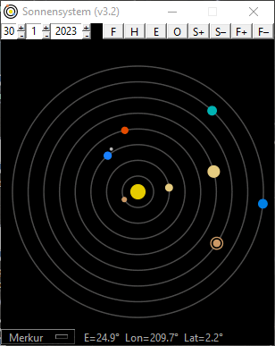
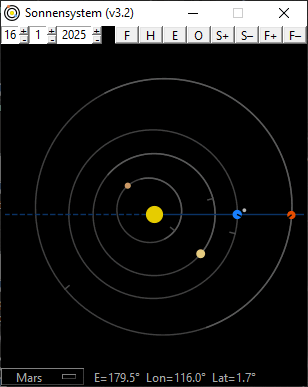
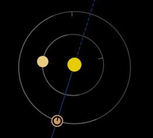
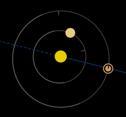
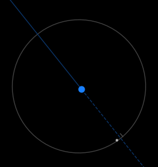
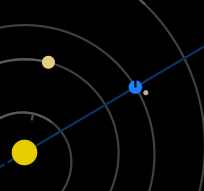

## Sonnensystem

Python GUI zur Ansicht der Planetenstellungen bei beliebigen Daten.

### Start

**Mit Python**  
Für alle im Header von **Sonnensystem.py** aufgeführten, benötigten Pakete, Prüfen ob sie in der Python Distribution installiert sind (`python -m pip show <package>`) und Installieren wenn nicht (`python -m pip install <package>`). Wenn alle Voraussetzungen erfüllt sind, mit `python Sonnensystem.py` ausführen.

**Executable für Windows-Benutzer**  
Für Windows-Benutzer ist unter Releases eine ZIP-Datei mit kompiliertem Programm verfügbar. Herunterladen, Entzippen und **Sonnensystem.exe** ausführen.

### Verwendung

**Ansichten**  
Das Startfenster zeigt die Planetenstellungen mit äquidistanten Bahnen. Die Erde ist im Winter der Nordhalbkugel oberhalb, im Frühling links, im Sommer unterhalb und im Herbst rechts der Sonne. Die Planeten sind auf kreisförmige Bahnen mit gleichem Abstand gezeichnet. Die Erde wird vom Mond begleitet. Mit der Schaltfläche O (für Orbits), oder mit der Tab-Taste erreicht man alternative, heliozentrische Ansichten der inneren und äußeren Planeten mit realen Orbits. Der Abstand des Mondes zur Erde ist in diesen Ansichten nicht maßstabsgetreu. Durch wiederholtes Drücken wird jeweils ein weiterer äußerer Planet bis hin zu Neptun hinzugefügt (siehe GIF). Als optische Hilfe für Oppositionen und Konjunktionen ist die dunkelblaue Linie eine erweiterte Verbindungslinie von der Sonne zur Erde. Planeten sind nachts auf der der Sonne abgewandten Seite der Erde sichtbar, dabei rechts der blauen Linie eher Abends, links der blauen Linie eher morgens. Die letzte Ansicht (auch durch Strg+O/Tab vom Ausgangspunkt erreichbar) ist eine geozentrische Ansicht der Mondposition. Die durchgezogene bzw. gestrichelte blaue Linie weist hier zur Sonne bzw. von der Sonne weg und zeigt bei überschreiten des Mondes Neumond bzw. Vollmond an.

  

**Datum**  
Es lässt sich oben ein beliebiges Datum einstellen und das Datum auch alternativ per rechts/links Pfeiltasten oder dem Mausrad verändern (Strg+Pfeiltasten in 3-Tage Schritten statt 1-Tage Schritten, alternativ je nach Klick ins Tage/Monat/Jahr-Feld mit hoch/runter Pfeiltasten). Die Taste H führt zurück zum heutigen Datum, die Taste J führt zur Epoche J2000.0 (01.01.2000 12:00 Uhr), von welcher ausgehend die Positionen berechnet werden. Die Positionen beziehen sich daher auch am jeweiligen Tag auf 12:00 Uhr mittags.

**Fenstergröße**  
Programmiertechnisch schwierig ist ein Fenster, welches vom Benutzer größer gezogen werden kann, aber das Seitenverhältnis beibehält. Deshalb gibt es die Buttons oben rechts, F+ und F- (F für Fenster) vergrößern und verkleinern das Fenster etwas. So kann man sich die gewünschte Fenstergröße selbst festlegen. Die Einstellungen werden für den nächsten Start in eine config-Datei geschrieben und dann übernommen. S+ und S- verändern die Schriftgröße der Schaltflächen.

**Features** (Perihels, Orbit- und Polneigungen)  
Kleine Striche an den Planetenbahnen zeigen die Position des Perihels. Bei jedem Periheldurchgang werden die Orbits des neuen Umlaufs neu berechnet (durch schrittweises Testen und Fits von Keplerbahnen an die gefundenen Positionen). Auch der Perihel wird dann je Umlauf angepasst. Außerdem bestehen alle Bahnen außer die der Erde aus einer etwas helleren und einer etwas dunkleren Hälfte, was veranschaulichen soll, wie die jeweilige Bahnebene relativ zur der der Erde geneigt ist. Der Übergang von der dunkleren zur helleren Hälfte ist der aufsteigende Knoten. Bei Erde, Mars, Saturn, Uranus und Neptun ist die Richtung der Polneigung mit einem schwarzen Einschnitt markiert. So kann man nachvollziehen, ob wir aktuell auf die Nord- oder die Südhalbkugel des jeweiligen Planeten schauen, oder wann Saturn bspw. wieder eine Kantenstellung erreicht.

**Winkelanzeige**  
Am unteren Rand kann ein Planet oder der Mond ausgewählt werden (alternativ mit Pfeiltasten hoch/runter), für den dann rechts davon Winkel angezeigt werden. E ist die Elongation des ausgewählten Planeten zur Erde (nahe E=180° in Opposition, nahe E=0° in oberer und unterer Konjunktion, E maximal für beste Sichtbarkeit von Merkur und Venus). Lon ist die ekliptikale Länge, d.h. der Winkel des Planeten innerhalb der Ebene der Erdbahn relativ zum Frühlingspunkt (L=0° für die Erde am 23.9.). Lat ist die eklitikale Breite, d.h. der Winkel des Planeten senkrecht zur Ebene der Erdbahn.

**Erde fixieren**  
Mit der Taste F (für Fixierung) oder der entsprechenden Schaltfläche kann die Position der Erde fixiert werden, sodass die Orbits und Perihels selbst mit laufender Zeit drehen.

**Sprung zu Elongation mit bester Sichtbarkeit**  
Mit der Taste E (für Elongation) oder der entsprechenden Schaltfläche kann zu Elongationen mit bester Sichtbarkeit des am unteren Rand ausgewählten Planeten gesprungen werden. Mit bester Sichtbarkeit ist bei den äußeren Planeten und dem Erdmond die Opposition (E=180°), bei den inneren Planeten ein lokales Maximum der Elongation (Merkur: E ca. 18°-28°, Venus: E ca. 45°-48°) gemeint. Bei den inneren Planeten wechseln sich bei der Funktion Morgen- und Abendsichtbarkeit ab. Oft ist eine fixierte Erde (siehe vorheriger Abschnitt) hier hilfreich.

### Beispiele

#### Marsoppositionen
Durchlaufen der kommenden Marsoppositionen mit fixierter Erde durch Auswahl des Mars am unteren Rand, einmaliges Drücken der Schaltfläche F und wiederholtes Drücken der Schaltfläche E. Man beachte die verschiedenen Stellungen des Marspols bei den Oppositionen. Bei den nahen Oppositionen ist stets der Südpol des Mars zu sehen.

#### Saturnopposition
Saturnopposition mit Nord-Ringöffnung (03.06.2016) / mit Kantenstellung (07.09.2024)
 

#### Supermond
Supermond (01.08.2023)

#### Venus am Morgenhimmel
Venus am Morgenhimmel mit maximaler Elongation (24.10.2023)
  

